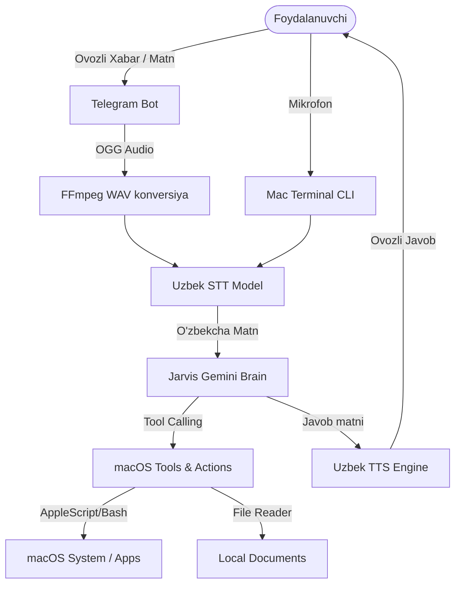

# 🤖 JARVIS — The Ultimate macOS AI Voice Assistant in Uzbek 🇺🇿

[](https://opensource.org/licenses/MIT)
[](https://www.python.org/)
[](https://apple.com/)

> **"Temir Odam" (Iron Man) loyihasidagi Jarvis kabi shaxsiy yordamchingiz endi o'zbek tilida va to'g'ridan-to'g'ri MacBook-ingizda!**
> MacBook-ingizni ovozli buyruqlar orqali boshqaring va uni dunyoning istalgan burchagidan Telegram orqali masofadan nazorat qiling.

---

## 🔥 Asosiy Imkoniyatlari (Key Features)

* 🎙️ **O'zbek nutqini aniqlash (ASR/STT):** Apple Silicon GPU (MPS) jadallatgichida ishlaydigan shaxsiy `rubaistt_v2_medium` modeli orqali o'zbekcha nutqni lahzalarda matnga o'giradi.
* 🗣️ **Tabiiy Ovozda Javob (TTS):** Edge TTS texnologiyasi yordamida eng yuqori sifatli tabiiy o'zbek ayol ovozida (`uz-UZ-MadinaNeural`) sizga ovozda javob qaytaradi.
* 📱 **Telegram Ratsiya Boshqaruvi:** Telefoningiz orqali botga ovozli xabarlar yuborib Mac kompyuteringizni masofadan boshqaring (Kino qo'yish, fayl yuborish, ekranni yopish).
* 🔒 **Xavfsizlik Whitelist Tizimi:** Xavfsizligingiz uchun bot faqat `.env` faylida ko'rsatilgan sizning shaxsiy Telegram ID raqamingizga bo'ysunadi.
* 🛠️ **macOS Tizim Boshqaruvi:** 
  * Ilovalarni ochish (Safari, Telegram, Spotify, Finder va h.k.).
  * Ekranni xavfsiz bloklash (Lock Screen) va ovoz/yorqinlikni sozlash.
* 📅 **Taqvim va Eslatmalar Integratsiyasi:** Apple Calendar'ga uchrashuv yozish, bugungi kun rejalarini o'qish, yangi eslatma yozish.
* 📚 **PDF va Word Hujjatlarni O'qish:** Kompyuteringizdagi PDF va Word (.docx) fayllarini o'qib, ularni tahlil qilish yoki xulosalash.
* 🔍 **Internetdan Ma'lumot Qidirish:** Ob-havo, yangiliklar va boshqa so'rovlarni Google/DuckDuckGo orqali tahlil qilib aytib beradi.

---

## 🛠️ O'rnatish va Sozlash (Installation & Configuration)

### 1. Talablar:
* macOS operatsion tizimi (Apple Silicon M1/M2/M3/M4/M5 tavsiya etiladi).
* `ffmpeg` (audio konversiya uchun). Uni o'rnatish uchun terminalda yozing:
  ```bash
  brew install ffmpeg
  ```

### 2. Loyihani yuklab olish va sozlash:
```bash
git clone https://github.com/SizningUsername/jarvis.git
cd jarvis
```

### 3. Virtual muhit yaratish va kutubxonalarni o'rnatish:
```bash
python3 -m venv venv
source venv/bin/activate
pip install -r requirements.txt
```

### 4. Sozlamalarni kiritish (.env):
Loyiha papkasida `.env` degan fayl yarating (yoki `.env.example` faylidan nusxa oling) va quyidagi kalitlarni yozing (hech qachon ushbu faylni GitHub'ga yuklamang!):
```env
GEMINI_API_KEY=sizning_gemini_api_kalitingiz
TELEGRAM_BOT_TOKEN=sizning_telegram_bot_tokeningiz
ALLOWED_TELEGRAM_USER_IDS=sizning_telegram_id_raqamingiz
```

---

## 🚀 Ishga Tushirish (How to Run)

Loyiha papkasida terminal orqali ishga tushiring:
```bash
./run.sh
```

Dastur yoqilganda sizga quyidagi buyruq rejimlari taklif etiladi:
* `[1]` **Ovozli buyruq:** Mikrofonga o'zbek tilida gapirib Mac-ni boshqarish.
* `[2]` **Matnli buyruq:** Test qilish uchun matn ko'rinishida buyruqlar kiritish.
* `[3]` **Chaqirish rejimi:** Har gal ENTER tugmasini bosib gapirish.

> 💡 **Telegram Bot rejimi:** Dastur yoqilishi bilan orqa fonda avtomatik ravishda sizning Telegram botingiz faollashadi. Siz telefoningizdan botga yozib buyruq berishingiz mumkin.

---

## 📊 Arxitektura Tizimi (Architecture Diagram)



---

## 🔒 Xavfsizlik va Maxfiylik (Security Notice)
Loyiha xavfsizligi mutlaqo ta'minlangan. Sizning API kalitlaringiz, Telegram tokeningiz yoki shaxsiy ID raqamlaringiz faqat shaxsiy `.env` faylida saqlanadi. Loyihadagi `.gitignore` fayli ushbu maxfiy ma'lumotlarni tasodifan GitHub'ga yuklanib ketishidan to'liq himoya qiladi.

---

## 📄 Litsenziya (License)
Ushbu loyiha **MIT Litsenziyasi** ostida taqdim etilgan. Batafsil ma'lumot olish uchun loyihadagi `LICENSE` faylini ko'ring.
